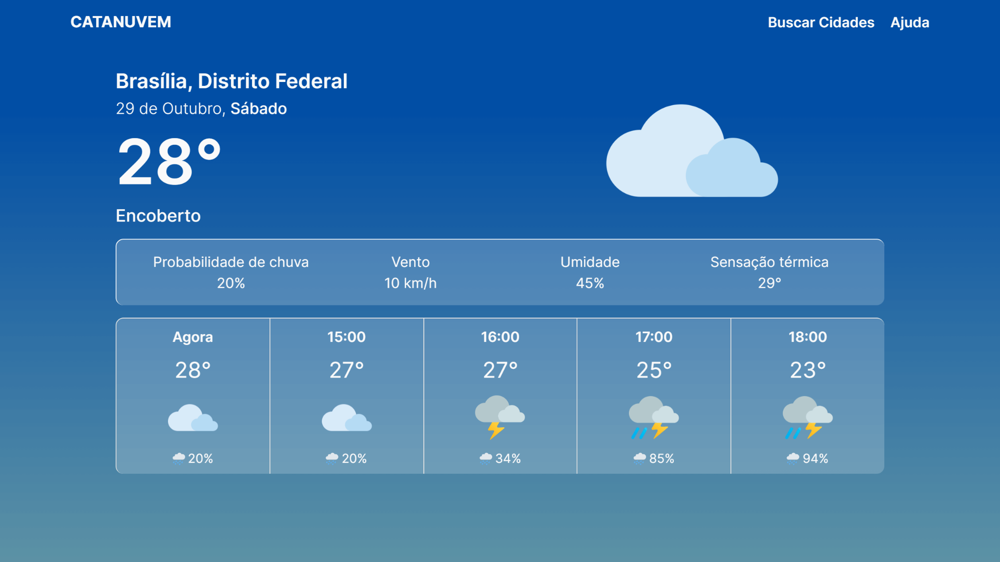
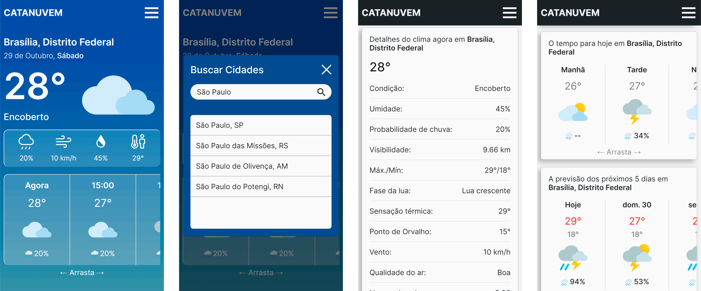

# Catanuvem ☁️
> Projeto construído com React JS

Aplicação Web para previsão do tempo simples e precisa. Várias informações metereológicas para qualquer lugar do Brasil.

Veja a aplicação em funcionamento aqui: https://catanuvem.vercel.app

## Sobre

Catanuvem é uma aplicação web para previsão climática. Consumindo dados de uma api própria de mesmo nome ([Api Catanuvem](https://github.com/DievanoD/api-catanuvem)). Esse projeto tem como objetivo solidificar e expandir conhecimentos em desenvolvimento web.

## Features

- Geolocalização
- Pesquisar clima pelo nome da cidade
- Mais de 5560 municípios brasileiros disponíveis para pesquisa
- Detalhes do clima para hoje, próximas horas e dias

## Como utilizar?

Permita o navegador utilizar sua localização para uma medição mais simples e precisa. Assim a aplicação pegará suas coordenadas e exibirá o clima mais perto de você.

Caso a permissão de usar sua localização seja negada, o app buscará a previsão climática da cidade padrão, que é Brasília, Distrito Federal.

Você também pode buscar pelos nomes das cidades para encontrar a cidade que deseja. São mais de 5560 municípios brasileiros disponíveis para pesquisa.

Projeto inspirado no The Weather Channel.

## Tecnologias

Projeto foi construído com as seguintes tecnologias:

- Typescript
- React JS
- React-bootstrap
- Sass